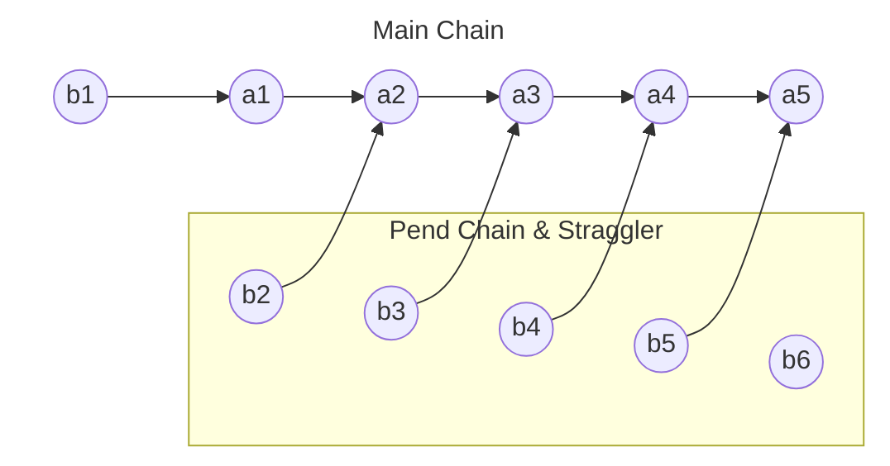
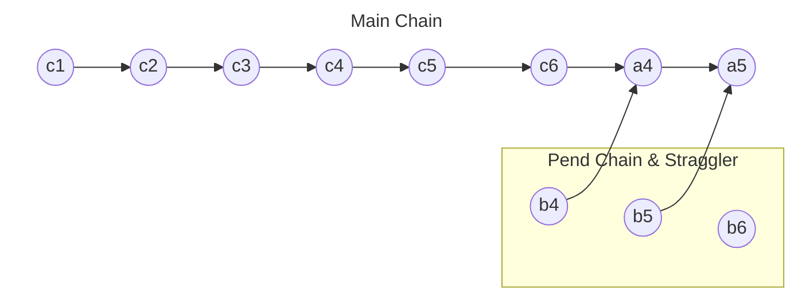

*This project has been created as part of the 42 curriculum by opapouts*  
*A project about the implementation of the Merge-Insert sort with containers*  

#  PmergeMe 

## 📖 Description
**In computer science, merge-insertion sort or the Ford–Johnson algorithm is a comparison sorting algorithm published in 1959 by L. R. Ford Jr. and Selmer M. Johnson. It uses fewer comparisons in the worst case than the best previously known algorithms, binary insertion sort and merge sort, and for 20 years it was the sorting algorithm with the fewest known comparisons. Although not of practical significance, it remains of theoretical interest in connection with the problem of sorting with a minimum number of comparisons.**

## 🛠️ Compilation and Usage
The goal of the Makefile is to automate as much as possible the testing and evaluation process of this project. You'll find a couple extra rules introduced on top of the basic ones.
### Extra Rules:
* **run** : It will run a simple test case of 5 values.
* **script** : It will run a simple bash command generating a range from 1 to 100000.
* **evaluation** : It will run the tests shown in the evaluation sheet of the project.

## 🧠 Ford-Johnson Algorithm Mechanics
>The implementation of this code can be separated into 3 distinct steps. Suppose we want to sort n elements.

**Step 1: Pairwise Grouping**
Group the input into $\lfloor n/2 \rfloor$ pairs. Compare elements within each pair (using one comparison per pair).
* Call the larger element in each pair $a_i$.  
* Call the smaller element in each pair $b_i$.  
* If $n$ is odd, leave the extra element aside (often call the straggler or odd).  
**At this stage we have $b_i < a_i$ for all $i$.**  

**Step 2: Recursive sort of the ai sequence**  
Recursively sort the larger elements $a_1, a_2, a_3, \dots, a_{\lfloor n/2 \rfloor}$ using the Ford-Johnson algorithm.  
When sorting, maintain the connection between each $a_i$ and its paired $b_i$. After sorting, order the pairs such that **$a_1 < a_2 < a_3 < \dots < a_k$**  

**Now we form two sequences**
* Main Chain: Starts initialized with b1, a1, a2, ..., ak.
* Pend Chain: The remaining uninserted b elements: {b2, b3..bk} (plus the odd element if $n$ was odd).  

**The diagram below shows the state of the chains after their creation.**  

**Step 3: Jacobsthal Insertion Order**  
We must insert the elements of Pend into the Main Chain using binary search. Because $b_i< a_i$ when inserting $b_i$, we never need to search beyond $a_i$ in the main chain.  
This bounds the size of our search area. To keep the maximum search boundary size to $2^k - 1$. The elements from the Pend Chain are inserted in groups defined by **Jacobsthal numbers**.

The Jacobsthal sequence is:
$J_0 = 0,\ J_1 =1,\ J_2 = 1,\ J_3 = 3,\ J_4 = 5,\ J_5 = 11\dots$
where $J_n = J_{n-1} + 2\times  J_{n-2}$.  
We insert pend elements backwards within blocks dictated by the Jacobsthal index differences.  
* $b_1$ is already in the main chain
* Next group boundary is $J_3 = 3$ $\rightarrow$ Insert $b_3$, then $b_2$.
* Next group boundary is $J_4 = 5$ $\rightarrow$ Insert $b_5$, then $b_4$.
* Next group boundary is $J_5 = 11$ $\rightarrow$ Insert $b_{11}, b_{10}, b_9$...

**The diagram below shows the state of the chains once the $J_3$ group is inserted.**

## Resources and AI Usage
Here is the documentation and all the articles I read to build this project.  
- [The Art Of Computer Programming](https://seriouscomputerist.atariverse.com/media/pdf/book/Art%20of%20Computer%20Programming%20-%20Volume%203%20(Sorting%20&%20Searching).pdf)  
- [DEV Article on the Ford-Johnson Algorithm](https://dev.to/emuminov/human-explanation-and-step-by-step-visualisation-of-the-ford-johnson-algorithm-5g91)  
- [Wikipedia Article on the Ford-Johnson Algorithm](https://en.wikipedia.org/wiki/Merge-insertion_sort)  
Throughout this project, I utilized AI as a learning tool in order to visualise better the index-based architecture, clarify the mathematical logic of the binary insertion and have a better understanding on how to keep the link between the $a_i$ and $b_i$ numbers.

